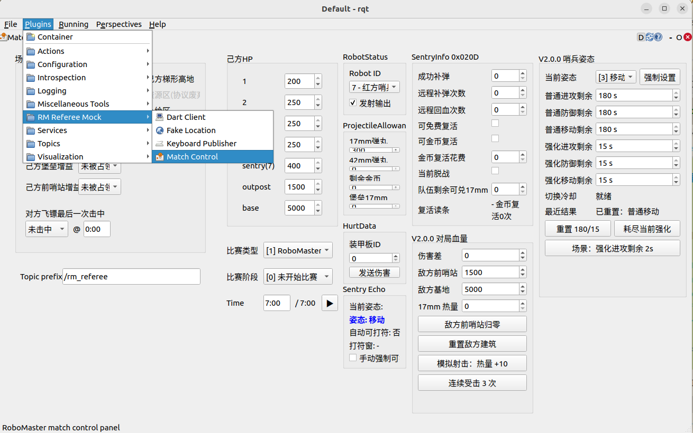

# rm_referee_mock

`rm_referee_mock` 是用于 RoboMaster 裁判系统联调的 rqt 工具包。在没有真实裁判系统时，它可以从图形界面生成比赛状态、机器人位置、键盘输入和飞镖客户端数据，并为哨兵自主决策指令提供简化的 `/rm_referee/tx` 服务端。

当前消息语义按《RoboMaster 2026 机甲大师高校系列赛通信协议 V2.0.0（20260626）》维护。

> 本包模拟 ROS 消息语义，不模拟完整串口链路、空口传输、重传和完整帧校验，不能替代真实裁判系统链路测试。

## 插件

| 插件 ID | 默认接口 | 用途 |
|---|---|---|
| `rm_referee_mock/MatchControl` | `/rm_referee/*`、`/rm_referee/tx` | 比赛阶段、血量、经济、补给、复活、姿态和能量机关 |
| `rm_referee_mock/FakeLocation` | `/rm_referee/robot_pos`、`/rm_referee/ground_robot_position` | 官方场地坐标中的机器人位置 |
| `rm_referee_mock/KeyboardPublisher` | `/rm_referee/mock/keyboard_mouse_control` | 自定义客户端键盘位域 |
| `rm_referee_mock/DartClient` | `/rm_referee/mock/dart_info`、`/rm_referee/mock/dart_client_cmd` | 飞镖状态和选手端指令 |

四个插件由 [plugin.xml](plugin.xml) 注册，在 rqt 菜单 `Plugins > RM Referee Mock` 下显示。

## 目录结构

```text
rm_referee_mock/
├── assets/                    # Match Control UI 与 Fake Location 场地图
├── rm_referee_mock/
│   ├── protocol/              # 0x0120 / 0x020D 编解码
│   ├── rules/                 # 金币、补给、复活、能量机关规则
│   ├── rqt_plugin_*.py        # rqt 插件入口和 ROS 适配
│   ├── *_widget.py            # Qt 界面
│   ├── match_control_*.py     # Match Control 功能模块
│   ├── sentry_posture.py      # 姿态状态机
│   └── publisher_pool.py
├── scripts/rqt_clean_start
├── test/
├── CMakeLists.txt
├── package.xml
└── plugin.xml
```

`protocol/`、`rules/` 和 `sentry_posture.py` 不依赖 Qt 界面，可直接由 pytest 测试。插件入口负责 ROS publisher、subscription、service 和定时器，Widget 负责显示和人工输入。

## 依赖与编译

主要依赖：

- ROS 2 Humble
- `rclpy`
- `rqt_gui`、`rqt_gui_py`
- `python_qt_binding` / PyQt5
- `tf2_ros`
- `rm_referee_msgs`
- `sentry_nav_bt_test`（Match Control 读取补给点时使用）

在工作空间根目录执行：

```bash
colcon build --packages-up-to rm_referee_mock
source install/setup.bash
```

## 启动

本包提供 `rqt_clean_start`，启动时清除旧 rqt 布局并强制重新发现插件。

启动 Match Control：

```bash
ros2 run rm_referee_mock rqt_clean_start
```

启动其他插件：

```bash
ros2 run rm_referee_mock rqt_clean_start fake_location
ros2 run rm_referee_mock rqt_clean_start keyboard
ros2 run rm_referee_mock rqt_clean_start dart_client
```

## Match Control



Match Control 默认使用 `/rm_referee` 话题前缀，以 10 Hz 更新主要状态。`HurtData` 仅在手动触发后发送。

### 发布话题

| 话题 | 消息类型 | 协议 ID |
|---|---|---:|
| `<prefix>/game_status` | `GameStatus` | `0x0001` |
| `<prefix>/game_robot_hp` | `GameRobotHP` | `0x0003` |
| `<prefix>/event_data` | `EventData` | `0x0101` |
| `<prefix>/robot_status` | `RobotStatus` | `0x0201` |
| `<prefix>/power_heat_data` | `PowerHeatData` | `0x0202` |
| `<prefix>/hurt_data` | `HurtData` | `0x0206` |
| `<prefix>/projectile_allowance` | `ProjectileAllowance` | `0x0208` |
| `<prefix>/rfid_status` | `RFIDStatus` | `0x0209` |
| `<prefix>/sentry_info` | `SentryInfo` | `0x020D` |

`<prefix>` 可在界面中修改。以下接口当前固定使用 `/rm_referee`：

| 接口 | 类型 | 用途 |
|---|---|---|
| `/rm_referee/robot_pos` | `RobotPos` subscription | 补给区自动检测 |
| `/rm_referee/mock/robot_pos` | `RobotPos` subscription | Mock 位置兼容输入 |
| `/rm_referee/tx` | `Tx` service | 接收 `0x0301 / 0x0120` 哨兵指令 |
| `map -> base_link` | TF lookup | 优先用于补给区自动检测 |

同一 ROS domain 中不要同时运行真实裁判系统与 Match Control 的 `/rm_referee/tx` 服务端。

### 比赛与规则

- 高校赛默认比赛时间为 7 分钟；
- 支持未开始、5 秒倒计时、比赛中和结算阶段；
- 比赛中每秒推进金币、补给、复活、姿态和能量机关状态；
- 补给点从 `sentry_nav_bt_test/config/waypoints.json` 的 `supply_point`、`supply_point_2` 加载，失败时使用内置备用值；
- 距补给点不超过 0.35 m 时判定进入补给区；
- 在补给区时恢复血量并领取按比赛分钟累计的 17 mm 弹量；
- 哨兵死亡后按比赛时间和金币复活次数计算复活读条；
- 支持免费复活和金币复活确认。

### 姿态

支持 1～6 六种姿态：

| 值 | 姿态 |
|---:|---|
| 1 | 攻击 |
| 2 | 防御 |
| 3 | 移动 |
| 4 | 强化攻击 |
| 5 | 强化防御 |
| 6 | 强化移动 |

普通姿态各累计 180 秒，强化姿态各累计 15 秒；强化时间耗尽后回到对应普通姿态。普通切换流程带 5 秒冷却，界面的强制设置用于直接构造测试状态。

### 能量机关

- 小能量机关机会在剩余 420 秒和 330 秒时增加；
- 大能量机关机会在剩余 240 秒、165 秒和 90 秒时增加；
- 收到 `0x0120 bit24` 请求后进入 20 秒激活窗口；
- 激活窗口内可在界面中设置成功，超时后恢复未激活。

### `/rm_referee/tx`

服务端接收至少 19 字节的消息，仅处理：

```text
cmd_id      = 0x0301
data_cmd_id = 0x0120
```

支持的语义：

- 免费复活确认；
- 金币复活确认；
- 补给区买弹累计值；
- 远程补弹、回血累计次数；
- 姿态请求；
- 能量机关激活请求。

`response.ok=true` 表示请求被识别并交给 Mock 处理，不表示动作已经成功。动作结果应从状态话题确认：

| 动作 | 确认话题 |
|---|---|
| 姿态 | `/rm_referee/sentry_info` |
| 能量机关 | `/rm_referee/event_data` |
| 复活 | `/rm_referee/robot_status`、`/rm_referee/sentry_info` |
| 买弹和金币 | `/rm_referee/projectile_allowance`、`/rm_referee/sentry_info` |

服务端不验证完整 SOF、Data Length、CRC8 和 CRC16。

## Fake Location


默认配置：

| 项目 | 默认值 |
|---|---|
| 话题前缀 | `/rm_referee` |
| 发布频率 | 10 Hz |
| 当前机器人 | 红方哨兵，ID 7 |
| 位置噪声 | `σ = 0 m` |
| 坐标范围 | X 为 0～28 m，Y 为 0～15 m |

可以拖动机器人位置和朝向，也可以直接编辑 X、Y 和角度。插件发布：

- `<prefix>/robot_pos`：当前选中哨兵的位置；
- `<prefix>/ground_robot_position`：英雄、工程、步兵 3、步兵 4 的位置。

位置消息使用 `frame_id=referee_system`。高斯噪声只作用于 X/Y，不作用于角度。

Match Control 的补给判断优先读取外部 `map -> base_link` TF；Fake Location 本身只发布裁判系统位置消息，不发布 TF。下图是与额外 TF 发布节点联合联调时的 RViz 示例：


场地图由 `assets/map.jpg` 提供，并随包安装。

## Keyboard Publisher


默认以 20 Hz 发布：

```text
/rm_referee/mock/keyboard_mouse_control
```

支持：

```text
W S A D Shift Ctrl Q E R F G Z X C V B
```

窗口需要保持键盘焦点。当前只填充 `keyboard_value`；鼠标 X/Y/Z 和三个按键字段保持为 0 或 `false`。

## Dart Client


默认前缀为 `/rm_referee/mock`：

| 话题 | 消息类型 | 协议 ID |
|---|---|---:|
| `<prefix>/dart_info` | `DartInfo` | `0x0105` |
| `<prefix>/dart_client_cmd` | `DartClientCmd` | `0x020A` |

界面可设置发射剩余时间、击中目标、累计击中次数、选定目标、发射站状态和最近指令时间。当前实现使用同一个 3 Hz 定时器发布两种消息。
